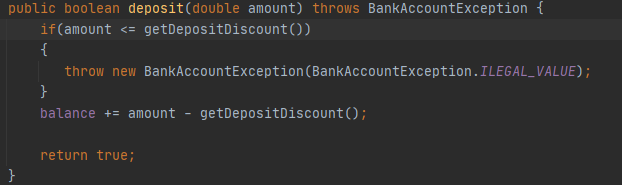
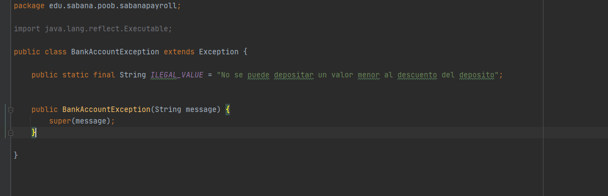

 # Laboratorio Excepciones

 ## Parte 1

 - ¿Cómo se lanza una excepción en JAVA?

  throw new Exception

 - ¿Cómo se propaga una excepción en JAVA?

   public void Algo() throws Exception

 - ¿Cómo se captura una excepción en JAVA?

   try
   {
     Algo()
   }
   catch(Exception e)
   {

   }

 - ¿Cuál es la diferencia en la implementación de las pruebas? ¿Validan lo mismo?

 No porque ya no validad que el metodo regrese un boolean, sino que ahora verifican que retornen una excepción en especifico

 ## Parte 4

 - ¿Por qué el compilador muestra estos errores?.

 Porque el metodo assigneFamilyCompensation puede lanzar una excepcion entonces toca definir si el metodo la va propagar o catch

 - ¿Qué debemos hacer para controlarlos?.

 Se debe realizar un try y catch para definir que hacer cuando se genera la excepcion

 - ¿Deben ser las excepciones en `SabanaPayroll` controladas o propagadas?.

 Deben ser controladas ya que las pruebas no deben ser modificadas, por lo cual deben retornar true o false

 ## Parte 5

 ### Para la clase bankAccount decidimos crear una excepcion para el metodo depositar, para ello creamos una clase excepción llamada bankAccountException en donde hay una excepción llamada ILEGAL_VALUE la cual se lanza cuando se intenta depositar un valor menor o igual al DEPOSIT_DISCOUNT.

 ## Evidencia

 

 
